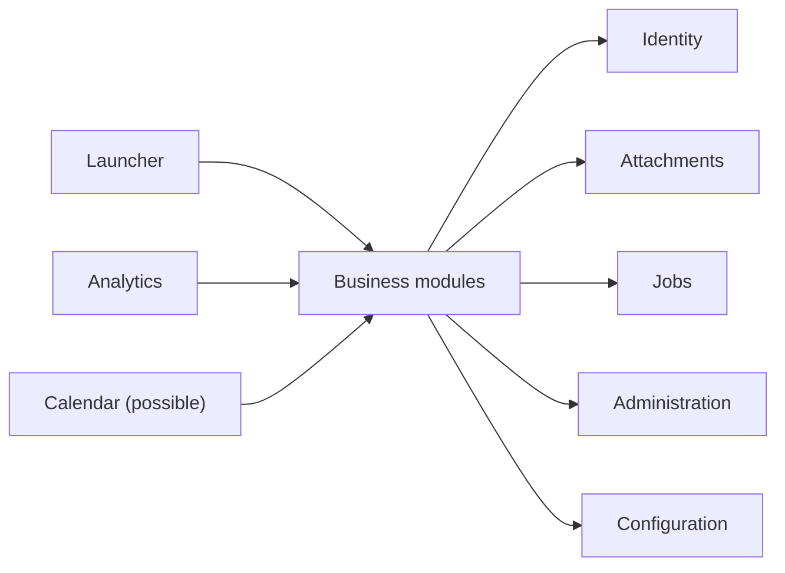

# Domain Organization

This document records the Phase 1 ownership and dependency model for Segaris Platform modules. It defines where capabilities belong and how modules may collaborate without deciding the detailed entities and workflows that remain Phase 2 work.

## Module Categories

Segaris organizes capabilities into platform modules, business modules, and cross-domain read modules.

The categories describe architectural responsibility rather than deployment units. Every module remains part of the same ASP.NET Core modular monolith and React application.

## Platform Modules

Platform modules provide narrowly defined capabilities that multiple business modules may consume.

### Identity

Identity owns:

- Users, roles, activation state, and profile information.
- Password credentials, sessions, lockout, and security stamps.
- The future user-bound API-key capability.
- The authenticated current-user contract consumed by other modules.

Identity does not own domain privacy rules beyond publishing the caller identity and platform roles. Each business module remains responsible for applying public and creator-only visibility to its own records.

### Attachments

Attachments owns:

- Physical file storage and controlled retrieval.
- File metadata, hashes where required, and storage identifiers.
- Common upload, validation, deletion, and consistency operations.
- Maintenance detection for missing and unreferenced files.

The owning business module decides whether an entity supports attachments and which users may access them. Attachments must validate that authorization through a module-owned contract or trusted ownership assertion rather than making domain records globally visible.

Attachments is not the Archive module. Attachments provides file infrastructure; Archive owns records whose business purpose is long-term document reference and organization.

### Jobs

Jobs owns the persistent background-job infrastructure, common lifecycle, claiming, progress, cancellation, interruption, and handler registration described in `docs/architecture/backend.md`.

Modules own the parameters, behavior, authorization, and result semantics of the job types they register.

### Administration

Administration owns platform-wide configuration and administrative operations that do not naturally belong to another module. This includes the initial single-household regional settings and operational configuration exposed through the application.

Segaris does not initially create a `Household` aggregate or tenant identifier. There is exactly one household, and multi-household tenancy is outside scope. A household entity may be introduced only if functional requirements establish meaningful household behavior beyond a settings record.

Administration must not become the owner of every classification or configuration screen. Module-specific categories, statuses, and rules remain owned by their domain even when only administrators may manage them.

### Configuration

Configuration owns reference catalogs whose semantics and lifecycle are
intentionally shared by several business modules. The initial catalogs are:

- Suppliers.
- Cost centers.
- Currencies.

Configuration publishes narrow read and validation contracts to business
modules. Consumers store stable catalog identifiers and may use database
foreign keys where the catalog lifecycle guarantees that referenced values are
not removed. They do not access Configuration's EF Core entities or tables
directly.

The initial Configuration foundation contains persistence, deterministic seed
data, read contracts, and read-only API queries. The separately planned
administrator-only Configuration experience adds catalog creation, rename,
ordering, deletion-impact evaluation, and atomic reference migration before an
in-use value is removed. Consuming modules implement narrow
Configuration-owned reference-management contracts; Configuration does not
query their tables or expose private records. See
`docs/requirements/CONFIGURATION_REQUIREMENTS.md`.

Configuration owns only catalogs with demonstrated cross-module semantics.
Module-specific classifications such as `CapexCategory` remain in their
business module even when the Configuration frontend presents their management
alongside shared catalogs.

### Launcher

Launcher owns:

- The catalog of modules available in the installed application.
- Module presentation metadata needed by the central launcher.
- Aggregation of the current user's simple module attention states.

Each module owns the rule that calculates its attention state. Launcher consumes the published result and does not query or interpret domain entities.

The initial module catalog is compiled with the application. Segaris does not require dynamic plugin discovery or runtime installation of unknown modules.

## Business Modules

The initial business-module candidates are:

- `Capex`: atomic income and expense records.
- `Opex`: recurring income and expenses grouped through contracts or equivalent recurring arrangements.
- `Inventory`: consumable items, stock, purchasing, and replenishment.
- `Travel`: personal and work trips, plans, bookings, documents, and related costs.
- `Assets`: durable objects where stock quantity is not the primary model.
- `Maintenance`: repairs and maintenance activity for physical elements.
- `Projects`: personal project hierarchies, work products, tasks, and risks.
- `Processes`: ordered multi-step activities with completion and due-date behavior.
- `Archive`: long-term document records and reference organization.
- `Firebird`: people, contacts, and interactions.
- `Clothes`: wardrobe items, accessories, and clothing-specific behavior.
- `Mood`: private or shared mood and emotion records for trend analysis.

This catalog records the intended module boundaries, not a commitment to implement every module in the first version. Phase 2 defines each module's purpose, entities, workflows, privacy defaults, classifications, attention rules, and calendar contributions.

Each business module owns:

- Its domain entities and persisted tables.
- Its categories, statuses, and other classifications unless a specific cross-domain requirement is documented.
- Its commands, queries, REST endpoints, validation, and authorization policies.
- Its search and filtering behavior.
- Its attachment relationships and deletion policy.
- Its attention-state calculation.
- Its domain events, due dates, or calendar projections when applicable.

Similar names do not create shared ownership. For example, a Capex category, Inventory category, and Archive category remain separate models unless functional planning proves that users need one common classification with shared lifecycle and semantics.

## Cross-Domain Read Modules

Cross-domain read modules aggregate published information but do not own or modify the source module's records.

### Analytics

Analytics initially targets financial trends based on Capex and Opex information. It consumes purpose-built read contracts or projections published by those modules.

Analytics does not update financial entities, bypass their visibility policies, or query their internal EF Core entities directly. Private data remains filtered for the current user before aggregation. Administrative aggregates must preserve the non-identifying privacy rule.

### Calendar

A common Calendar may be introduced if Phase 2 confirms that events and due dates from several modules belong in one shared experience.

Calendar would consume published event projections from participating modules. Each source module remains authoritative for the event, its visibility, and the action opened from it. Calendar does not become a generic owner of every domain date.

Until that functional decision is made, calendar support is a possible cross-domain read module rather than a settled implementation module.

## Dependency Rules

The initial dependency direction is:

The arrows represent consumption of published contracts, not access to another module's entities, tables, or internal services.

The following rules apply:

- Business modules do not depend directly on one another by default.
- Platform modules must remain narrowly scoped and must not absorb domain behavior for convenience.
- Cross-domain read modules depend on source-module read contracts and never become write gateways into those modules.
- Circular module dependencies are prohibited.
- A module publishes the minimum interface or immutable contract needed by a consumer.
- Published contracts use stable identifiers and purpose-built data rather than EF Core entities.
- Consumers may not derive access rights from identifiers alone; the provider enforces visibility and authorization.
- A dependency is documented when introduced, including its purpose and deletion or unavailability behavior.

Architecture tests should enforce known namespace and project dependency rules where practical. Code review remains responsible for semantic violations that static dependency tests cannot detect, such as querying another module's tables through raw SQL.

## Cross-Module References

A domain record may refer to a record owned by another module only when the functional relationship is explicit and valuable.

The consuming module stores an opaque stable identifier or its own immutable snapshot according to the use case. It does not use the provider's internal entity type as part of its model.

Every cross-module reference must define:

- Whether the relationship is optional or required.
- Which module initiates creation or linking.
- What information is read live and what is copied as a historical snapshot.
- What happens when the source record is hidden, deactivated, or deleted.
- Whether database-level foreign-key enforcement is compatible with privacy and deletion behavior.
- How imports, exports, and restoration preserve or repair the relationship.

Examples deliberately deferred to Phase 2 include:

- Whether Maintenance refers to Assets and how asset deletion affects maintenance history.
- Whether Travel owns its costs, creates Capex entries, or publishes a financial projection.
- Whether Projects and Processes share tasks or only integrate through references.
- Whether Archive records link to documents owned by other modules or only manage their own records.
- Which modules publish event projections to a common Calendar.

## Shared-Code Discipline

Segaris does not create a broad `Common` domain containing generic categories, statuses, notes, reminders, or base entities.

Code is shared only when the semantics and lifecycle are genuinely common. Technical primitives may live in the small shared platform layer described in `docs/architecture/backend.md`. Domain duplication is acceptable when two concepts merely look similar but can evolve independently.

When repeated behavior emerges, the preferred sequence is:

1. Keep ownership in the modules while the semantics are still uncertain.
2. Compare the actual rules and lifecycle after more than one implementation exists.
3. Extract a shared platform capability only when one coherent owner and contract are clear.

Premature abstraction must not create coupling between modules that otherwise have independent purposes.

## Open Functional Decisions

- Define the detailed entity and workflow model inside each business module.
- Decide the concrete cross-module relationships listed above.
- Decide whether Calendar becomes a shared module and which event projections it consumes.
- Define module-specific categories, statuses, notes, reminders, and attention conditions.
- Define how modules are enabled, ordered, and presented in the Launcher.
